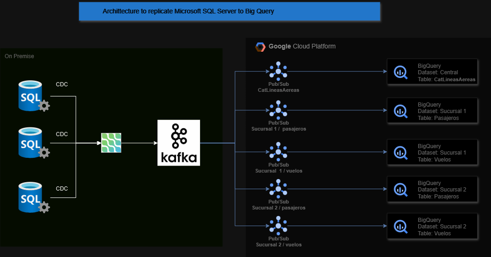
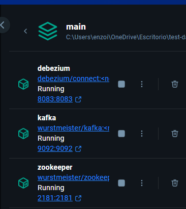
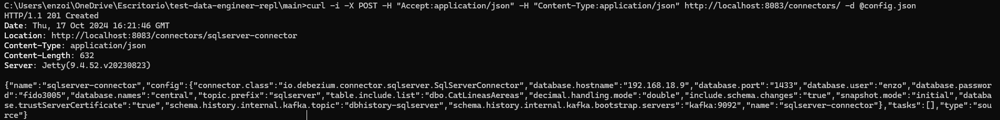
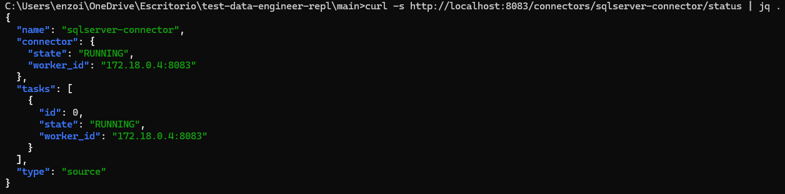
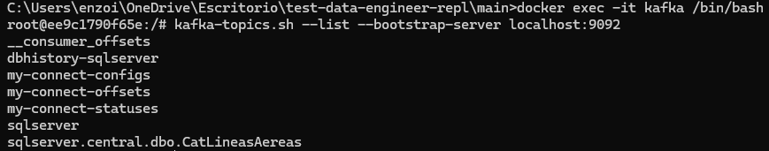
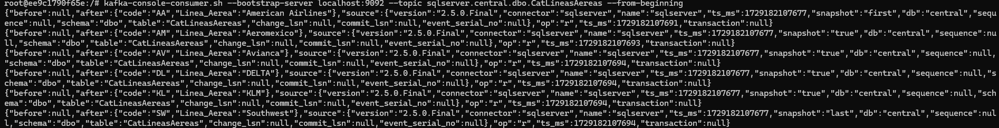
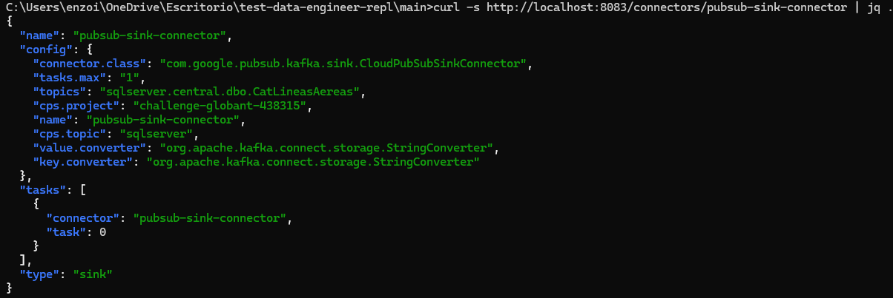
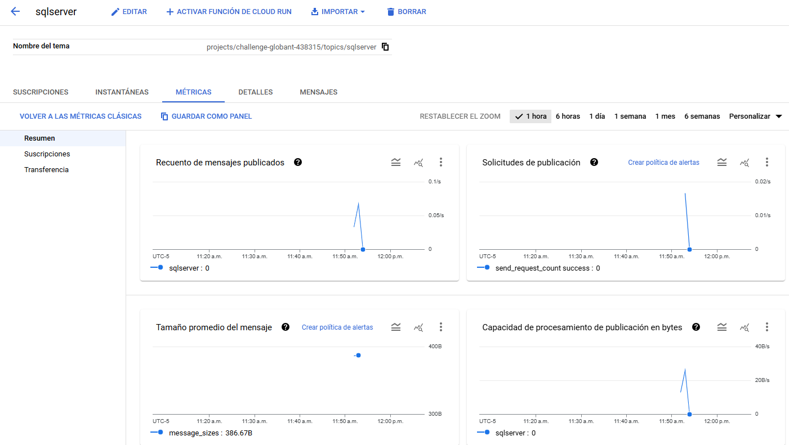
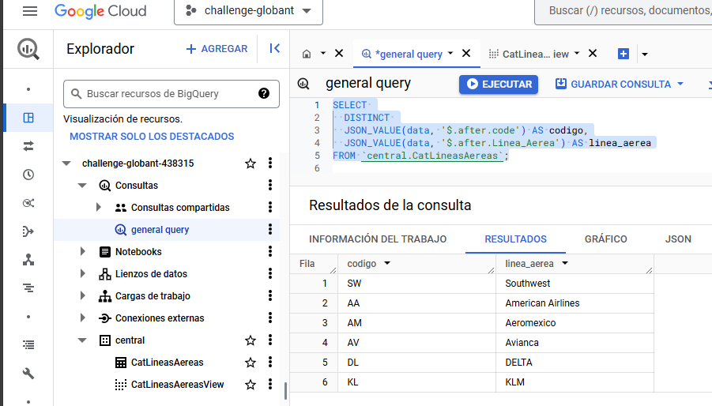

# Solución
El presente documento tiene como objetivo presentar la solución propuesta para el challenge DEACERO.
## Arquitectura
La arquitectura propuesta utiliza la tecnología CDC para enviar los cambios de la base de datos hacia kafka a forma de mensajes. Para esto se utiliza un conector de debezium. A continuación se utiliza un conector oficial de google para enviar dichos mensajes hacia un tópico de Pub/Sub en GCP.
Estos mensajes son transportados por un suscriptor de Pub/Sub hacia una tabla de Big Query desde la cual se pueden consultar los datos desde el mensaje en formato JSON para reconstruir las tablas y crear vistas a partir de ellos para su fácil consumo.



## Paso a Paso
Los pasos para la implementación de esta arquitectura son los siguientes
### Alta de bases de datos y activación de CDC
Primero asumimos el caso en el que no se ha dado de alta la base de datos y la creación de la tabla.

```SQL
CREATE DATABASE central;

USE central;
CREATE TABLE CatLineasAereas (
    code CHAR(2) CONSTRAINT PK_CatLineasAereas PRIMARY KEY,
    Linea_Aerea VARCHAR(150) NOT NULL
);
```

A continuación pasamos a la activación del CDC primero en la base de datos y luego en la tabla mencionada.

```SQL
USE master
GO

ALTER DATABASE central
SET ALLOW_SNAPSHOT_ISOLATION ON;
GO

USE central;
GO
EXEC sys.sp_cdc_enable_db;
GO

EXEC sys.sp_cdc_enable_table
    @source_schema = N'dbo',
    @source_name = N'CatLineasAereas',
    @role_name = NULL,
    @supports_net_changes = 1;
GO
```
### Alta de Servicios (Zookeper, Kafka, Kafka Connect)

Para el alta de servicios en este caso se utilizo docker, sin embargo, el objetivo es asegurar que existan estos servicios para realizar el consumo de los mensajes CDC.

El archivo usado para el alta de los servicios se encuentra en [Docker-compose](docker-compose.yml). Es importante resaltar en este archivo lo siguiente:
- En el servicio de Kafka se tiene el siguiente parámetro para la creación de un tópico desde el a creación del servicio, este tópico será utilizado luego en el servicio de kafka connect.
```yml
environment:
    KAFKA_CREATE_TOPICS: "dbhistory-sqlserver:1:1"
```
- En el servicio de Kafka Connect (Debezium) se tienen los siguientes parémtros que permiten la importación del archivo que contiene la llave de conexión hacia la nube de GCP y los archivos .jar con los conectores.

```yml
volumes:
    - ./conector/debezium-connector-sqlserver-3.0.0.Final.jar:/kafka/connect/debezium-connector-sqlserver-3.0.0.Final.jar
    - ./conector/pubsub-group-kafka-connector-1.3.0.jar:/kafka/connect/pubsub-group-kafka-connector-1.3.0.jar
    - ./keyfile.json:/kafka/key/keyfile.json
```

Con esto específicado se pueden dar de alta los servicios con el comando
```bash
docker compose -f docker-compose.yml up -d
```



una vez dado de alta se hace la petición de conexión a la base de datos por medio de un comando curl y el archivo de configuración [config](config.json).

```bash
curl -i -X POST -H "Accept:application/json" -H "Content-Type:application/json" http://localhost:8083/connectors/ -d @config.json
```



El estado del conector puede revisarse con el siguiente comando

```bash
curl -s http://localhost:8083/connectors/sqlserver-connector/status | jq .
```


Con esto ya deberíamos poder observar los mensajes de CDC en en un tópico de Kafka creado para la tabla.

Desde el bash de kafka se puede ejecutar el siguiente comando para listar los tópicos:

```bash
kafka-topics.sh --list --bootstrap-server localhost:9092
```

En la imagen podemos observar el tópico creado para la tabla CatLineasAereas

Adicionalmente si usamos un suscriptor podremos ver los mensajes con el siguiente comando:
```bash
kafka-console-consumer.sh --bootstrap-server localhost:9092 --topic sqlserver.central.dbo.CatLineasAereas --from-beginning
```


A continuación se procede con la conexión hacia Pub/Sub en google utilizando el archivo [sink](sink.json).

```bash
curl -i -X POST -H "Accept:application/json" -H "Content-Type:application/json" http://localhost:8083/connectors/ -d @sink.json
```


El estado del conector puede revisarse con el siguiente comando

```bash
curl -s http://localhost:8083/connectors/pubsub-connector/status | jq .
```



Con ambos conectores dados de alta podemos confiar en que los mensajes están siendo enviados hacia pubsub.
Esto podemos monitorearlo desde la consola de GCP.



Finalmente, al crear el tópico es posible habilitar la opción de extracción hacia Big Query, con lo que podemos tener los mensajes en formato json enviados directamente hacia Big Query. Con esto tenemos la información disponible para múltiples propositos a través de los suscriptores y tenemos la información enviada hacia big query con baja latencia.
Finalmente en Big Query se puede extraer dicha información.




## Hallazgos

En la implementación de la solución se encontraron con múltiples dificultades, como la disponibilidad de conectores de forma gratuita. La opción por la que se optó permite cumplir con los requerimientos y adicionalmente ofrece una opción de bajo costo. Es importante resaltar que la opción de extraer los mensajes hacia bigquery nos permite prescindir de un servicio que tenga que ser administrado como podría ser dataflow. Adicionalmente la disponibilidad de los mensajes en bigquery para multiples suscriptores da opción a hacer más con los mensajes que solo llevarlos hacia el data warehouse, como disparar múltiples opciones.


